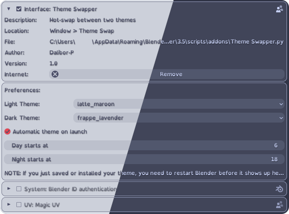

# Theme Swapper

A Blender add-on that lets you quickly swap between two of your themes. Ideal if you want to swap between light and dark themes for day and night work.

Optionally allows you to load the correct theme based on time of day on start-up.

The themes used are [Catppuccin](https://github.com/Dalibor-P/blender).

## Installation

1. Clone or download this repository locally.

2. Start Blender. `Edit → Preferences → Add-ons → Install`.

3. Locate and install `Theme Swapper.py`.

4. Edit the settings to your liking.

5. Access the add-on through `Window → Theme Swap`.

